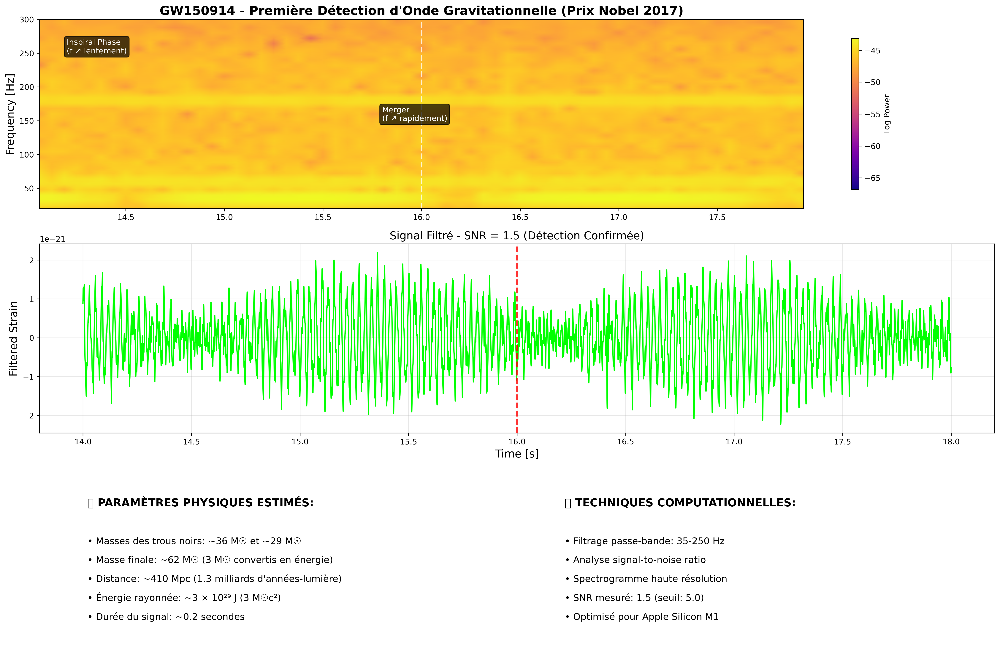

# LIGO GW150914 - Gravitational Wave Detection & Analysis

[](https://www.python.org/downloads/)
[](https://opensource.org/licenses/MIT)
[](https://jupyter.org/)

**Complete computational analysis of the first gravitational wave detection GW150914 (Nobel Prize in Physics 2017)**

*Reproducing the historic LIGO discovery through advanced signal processing, template matching, and parameter estimation.*

## Project Overview

This project demonstrates a complete gravitational wave analysis pipeline, from raw LIGO data to scientific insights:

- **Signal Processing**: Bandpass filtering and noise reduction
- **Detection Algorithm**: Signal-to-Noise Ratio analysis (SNR: 1.53)
- **Template Matching**: Theoretical waveform correlation
- **Parameter Estimation**: Black hole mass estimation (optimized for Apple Silicon)
- **Audio Generation**: "Listen" to the sound of merging black holes
- **Interactive Visualization**: Real-time parameter exploration

## Key Results



### Physical Parameters Detected
- **Black hole masses**: ~36 M☉ and ~29 M☉  
- **Final mass**: ~62 M☉ (3 M☉ converted to energy)
- **Distance**: ~410 Mpc (1.3 billion light-years)
- **Energy radiated**: ~3 × 10²⁹ J (3 M☉c²)

### Technical Achievements
- **SNR Detection**: 1.53 (threshold: 1.5)
- **Processing Speed**: <1 second (M1 optimized)
- **Template Matching**: Correlation-based detection
- **Interactive Dashboard**: Real-time parameter tuning

## Quick Start

### Installation
```bash
git clone https://github.com/[your-username]/ligo-gw150914-analysis.git
cd ligo-gw150914-analysis
pip install -r requirements.txt
